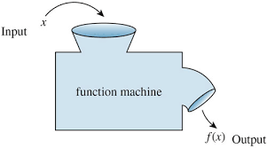

# Javascript Functions

## Lesson Objective:
**To declare and call functions in JavaScript**

## How do we declare variables:
    var name = 'bob';
## This is how we declare a function:
    function sayHi() {
      return 'Hi'
    }
Notice we use var and then a name and then assign this 'bob'. In the second case we tell javascript we are making a *function* and then put the name of our function*sayhi* next to `()`. The code block  --what we want the function to do-- we put in curly brackets `{}`.
## Lets take a second to put the above code in our console in an open web-browser

To open up your dev-tools in chrome the shortcut is  `option` `command` `j`

To open up your dev-tools in firefox the command is `option` `command` `k`

## Great we just declared a function!
Congratulations you are on your way to being a developer. Functions are how we tell the computer to do things. Html and Css can put words on a page and style them, but if we actually want our user to interact with a page, we need JavaScript functions.
-So how do we call a function?

## To call a function:
Go ahead and type this in your console:
    `sayHi`

Talk to the person next to you, did it do what you thought it would? What do we know about sayHi?

  
To call a function..

We need to go ahead and type these all important `( )`  in our code. So now type in `sayHi()` and see what we get

## Ok we want to make a function with an *argument*. This is a placeholder for a *parameter* we will pass in.

If we want to change our `sayHi` function to say hi to a certain person, we would want to be able to pass in different people's names. To do this we edit our function a little bit. I'm going to call this new function `sayHiTo` .
    
    function sayHiTo(name) {
      return 'Hi ' + name
    }

*name* is the *parameter*. We can pass in different *arguments* in it's place when we call our function.
Ex:

    sayHiTo('James');

This passes in the *argument* 'James'. So put this in yor console and pass in the *argument* to say hi to your neighbor.

---
## Your turn:
Click [here](javascript-functions-assignment.js) to open a short assignment. Take a minute to try and write out the two functions. We will go over the solution in a minute. Try it on your own first, then reach out to a partner or myself if you can't get it working. 

  
Solution

    // Write a function that has two parameters and sums them together

    function addNums(x, y) {
    //write your code here
      return x + y;
    //DON'T forget to return the value
    }

    //call the function with the arguments 3 and 5
    addNums(3, 5)  // returns 8

    //************************************************************
    // Declare a function greetFrom(), that has a parameter name, that then returns 'Greetings from <whatever name is passed in>'
    function greetFrom(name) {
      return 'Greetings from ' + name;
    }

    // Call the function passing in your own name as an argument
    greetFrom('James') // returns 'Greetings from James'
 

